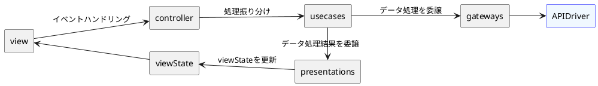

# vue-todo-with-cleanArchitecture

clean architecture勉強用Todoアプリ

## Setup

```bash
# install
npm install

# Compiles and hot-reloads for development
npm run dev

# Compiles and minifies for production
npm run build
```

## Directory Configuration

```
src
|-- main.ts
|-- features
|   `-- constants
|-- controllers
|-- entities
|   `-- vo
|-- usecase
|-- infrastructure
|   |-- TaskApi.ts
|   `-- axios
|       `-- config.ts
|-- repositories
|-- presenters
|-- interfaces
|   |-- infrastructure
|   |-- presenters
|   |-- gateways
|   |-- usecases
|   `-- view
`-- view
    |-- App.vue
    |-- components
    |   |-- globals
    |   |-- pages
    |   `-- parts
    |       `-- task
    |           |-- TaskListHeader.vue
    |           `-- TaskListItems.vue
    |-- hooks
    |   `-- task
    `-- index.css
```

### Dependency Rules


1. 外側のモジュールから内側のモジュールに向かってのみ依存することができる。
2. 内側のモジュールはインターフェースを介して外側のモジュールを使用する。(依存性逆転)

### controllers

外界からの入力に応じた処理振り分けを行う。

### usecases

アプリケーション固有の業務ロジックを担当する。controllerの処理振り分けにより実行される。gatewayによるデータ処理と、処理結果をpresenterに伝播させる。

### entities

一般的な規則などを抽象化したオブジェクト。データの加工やバリデーションなどの業務ロジックを担当する。

### gateways

usecaseからインターフェースを介して実行される。DB保存やAPI実行などのデータ操作を抽象化する。infrastructureのインターフェースを介して、DBからの取得や保存、API実行などを行う。

### infrastructure

DB操作、API実行の具体的な処理を行う。

### presenters

usecaseから伝えられた処理結果を画面表示用に整形する。整形した処理結果はviewStateを介してviewで使用される。

### view

ユーザーが直接触れる画面と、そのコンポーネントを取りまとめる。各画面は、それぞれが必要なcontrollerを生成し、画面操作に応じてcontrollerメソッドが実行される。

### Process Flow


