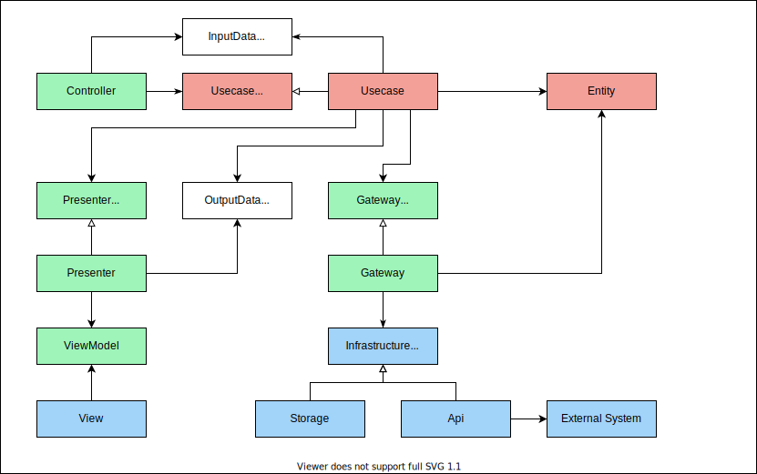

# vue-todo-with-cleanArchitecture

clean architecture勉強用Todoアプリ

## Setup

```bash
# install
npm install

# Compiles and hot-reloads for development
npm run dev

# Compiles and minifies for production
npm run build
```

## Dependency Rules

* 下図に従う。
* 外側のモジュールから内側のモジュールに向かってのみ依存する。
* 内側のモジュールはインターフェースを介して外側のモジュールを使用する。


### Adapter Layer

図のInterface Adaptersに該当する。外部と内部のデータ連携を実行する。

#### Controllers

* 外界からの入力に応じた処理振り分けを行う。
* 外界からの入力からDTOを生成し、usecasesに渡す。
* ControllerFactoryにより生成する。

#### Gateways

* DB保存やAPI実行などのデータ操作を抽象化する。
* 内部のUsecaseからインターフェースを介して実行される。
* infrastructureのインターフェースを介して、DBからの取得や保存、API実行などを行う。
* 外部から取得した値をEntitiesに変換して呼び元に返却する。

#### Presenters

* usecaseから伝えられた処理結果を画面表示用に加工する。
* 整形した処理結果はviewModelとしてviewに渡す。

### Domain Layer

中心円のApplication Business Rules、Enterprise Business Rulesに該当する。ユースケースに基づいて、アプリケーションが取り扱うデータの整形や、業務ロジックに基づいた処理を実行する。

#### Usecases

* アプリケーション固有の業務ロジックを担当する。
* controllerの処理振り分けにより実行される。
* データ処理をgatewayに、データ処理結果の整形をpresenterに委譲する。
* controllers、presentersとのデータ連携には、DTOまたはプリミティブな値を用いる。

#### Entities

* 一般的な規則などを抽象化する。
* データの加工やバリデーションなどの業務ロジックを担当する。

### Drivers Layer

最外円のFrameworks&Driversに該当する。ストレージ操作、API実行の具体的な処理を行う。

### View

最外円のFrameworks&Driversに該当する。ユーザーが直接触れる画面と、そのコンポーネントを取りまとめる。各画面は、必要なcontrollerを生成して、画面操作に応じたcontrollerメソッドを実行する。

## Process Flow



