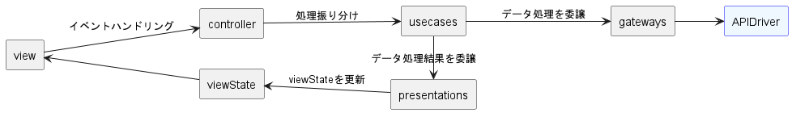

# vue-todo-with-cleanArchitecture

clean architecture勉強用Todoアプリ

## Setup

```bash
# install
npm install

# Compiles and hot-reloads for development
npm run dev

# Compiles and minifies for production
npm run build
```

### Dependency Rules

* 下図に従う。
* 外側のモジュールから内側のモジュールに向かってのみ依存する。
* 内側のモジュールはインターフェースを介して外側のモジュールを使用する。


### controllers

* 外界からの入力に応じた処理振り分けを行う。
* ControllerFactoryにより生成される。
* 生成するために必要なインスタンスは、各種ControllerFactoryを継承したクラスで定義する。

### usecases

* アプリケーション固有の業務ロジックを担当する。
* controllerの処理振り分けにより実行される。
* gatewayによるデータ処理と、処理結果をpresenterに伝播させる。

### entities

* 一般的な規則などを抽象化する。
* データの加工やバリデーションなどの業務ロジックを担当する。

### gateways

* usecaseからインターフェースを介して実行される。
* DB保存やAPI実行などのデータ操作を抽象化する。
* infrastructureのインターフェースを介して、DBからの取得や保存、API実行などを行う。

### infrastructure

* ストレージ操作、API実行の具体的な処理を行う。

### presenters

* usecaseから伝えられた処理結果を画面表示用に整形する。
* 整形した処理結果はviewStateを介してviewで使用される。

### view

* ユーザーが直接触れる画面と、そのコンポーネントを取りまとめる。
* 各画面は、必要なcontrollerを生成して、画面操作に応じたcontrollerメソッドを実行する。

### Process Flow


